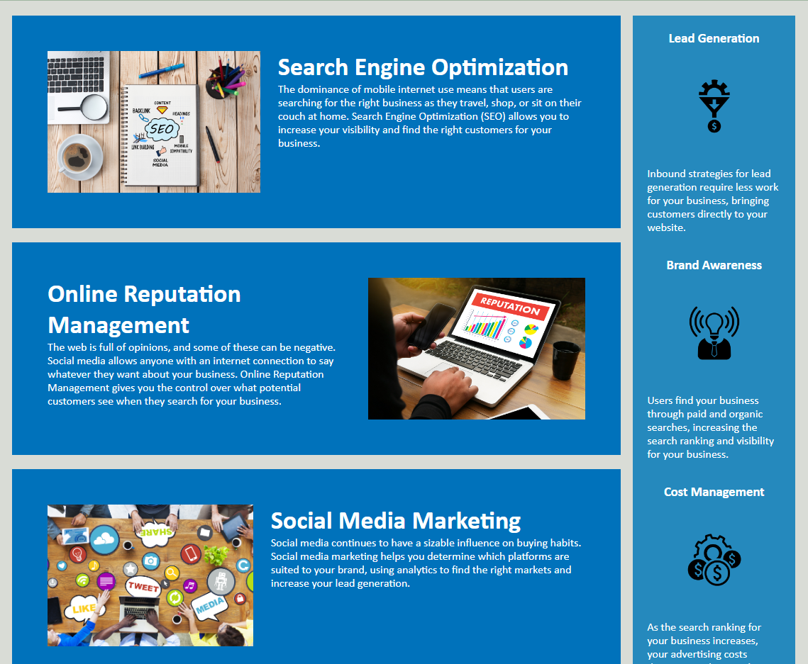

# Horiseon Code Refactor

## **Description**

This project was the first challenge of our boot camp focused on refactoring a Horiseon webpage to create a more efficient and optimized code. We were asked to review the provided source code and make changes as we see fit to meet the acceptance criteria. 

The deployed app can be accessed here: https://jwatkins28.github.io/Horiseon-Code-Refactor/

---

## Acceptance Criteria
```
GIVEN a webpage meets accessibility standards
WHEN I view the source code
THEN I find semantic HTML elements
WHEN I view the structure of the HTML elements
THEN I find that the elements follow a logical structure independent of styling and positioning
WHEN I view the icon and image elements
THEN I find accessible alt attributes
WHEN I view the heading attributes
THEN they fall in sequential order
WHEN I view the title element
THEN I find a concise, descriptive title
```

## **Preview**


Deployed App: https://jwatkins28.github.io/Horiseon-Code-Refactor/

## **List of Changes**

### HTML Changes: 
*All changes made to HTML are also documented in the index.html file*
- Added meta tag viewport for best practices
- Updated Title to be more specific/descriptive
- Added alt text to all images/graphics
- Changed .search-engine-optimization, .online-reputation-management, .social-media-marketing from classes to IDs to remove redundancy but keep the links on the page working
	#### Semantic Changes:
	- ` Changed header <div> to <header> and removed redundant class `
	- ` Changed nav <div> to <nav> `
	- ` Changed background picture <div> to <figure> `
	- ` Changed content <div> to <main> `
	- ` Changed the 3 <div> sections in <main> to <article> `
	- ` Changed sidebar <div> to <aside> `
	- ` Changed footer <div> to <footer> and removed class  `

### CSS Changes:
 *All changes made to CSS are also documented in the style.css sheet*
- Changed ".header" class to "header" element selector
- Changed all the ".head div" sections to "nav" selector and removed redundant selectors
- Changed the order of the "main" and "aside" selectors to better reflect the semantics of the HTML
- Changed #search-engine-optimization, #online-reputation-management, #social-media-marketing from classes to IDs and also condensed redundant selectors
- Changed ".benefits" to "aside" 
- Combined all the repetitive redundancies for the various .benefit selectors
- Changed footer class selector to footer element selector to match semantic html changes

---

## **Usage**

To view/use this project, it can be accessed by going [here](jwatkins28.github.io/Challenge-One-Horiseon). If you'd like to view the code you can use the DevTools in your browser or view the files in the repository. In the style.css file, all the changes made are documented.

---

## **Credits**

- UT Bootcamp
- Nikki and the TA's
- Myself 😁 

---